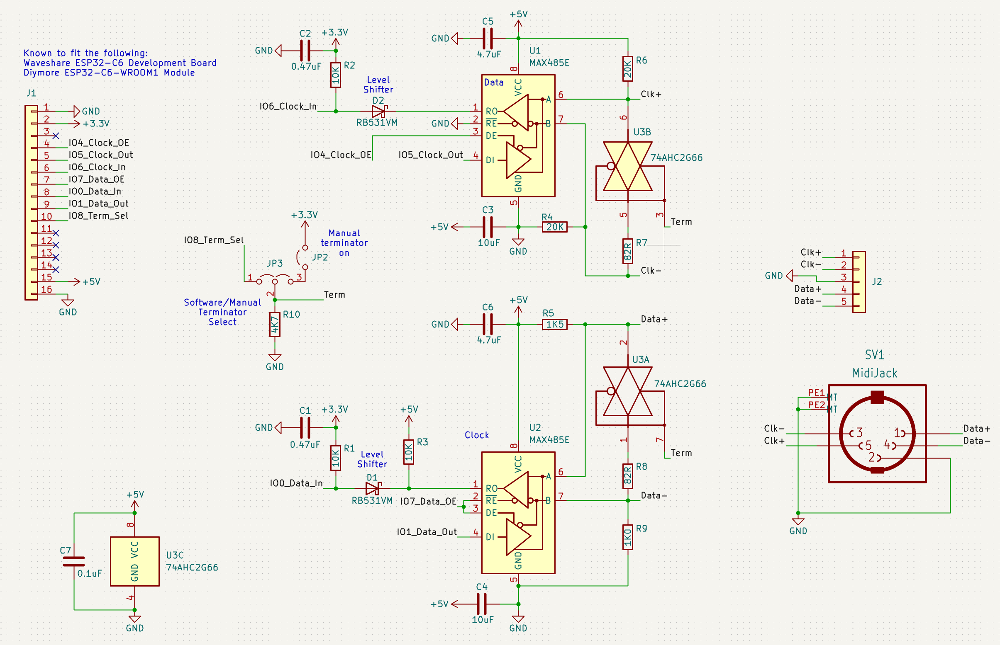
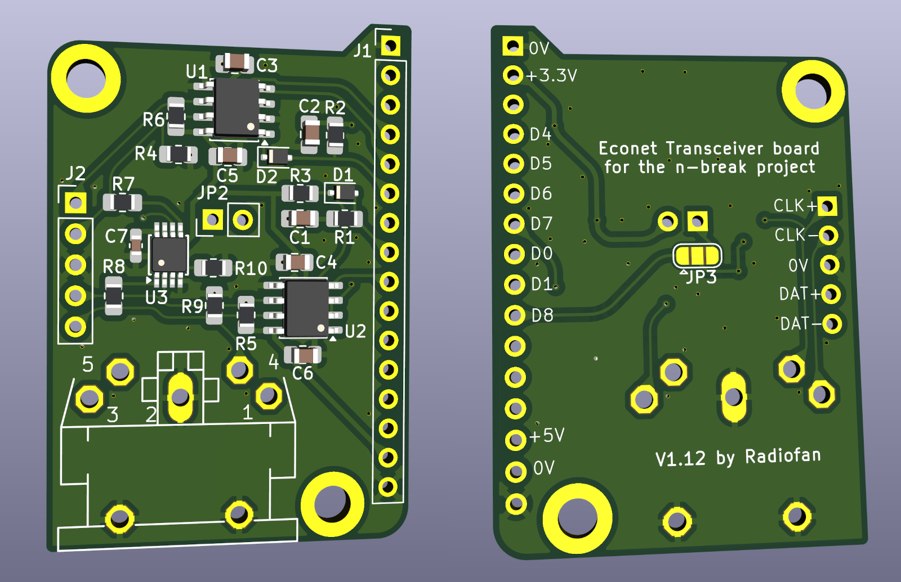

# nbreak_pcb
This is an Econet transceiver PCB designed for [the n-break project](https://github.com/banksy-git/nbreak-econet), using Kicad.

The board is intended to be soldered to an ESP32-C6 module, the following are know to fit:

- Waveshare ESP32-C6 Development Board
- Diymore ESP32-C6-WROOM1 Module

Many others have a suitable pinout.

The board hosts 2 MAX485 chips running at 5V with level shifters for interfacing with the ESP32-C6.

Connection is via 5-pin DIN and/or 5-pin header.

There are links for selecting internal vs external clock and for enabling on-board terminators.

Note: This is still in development, there might be problems.

