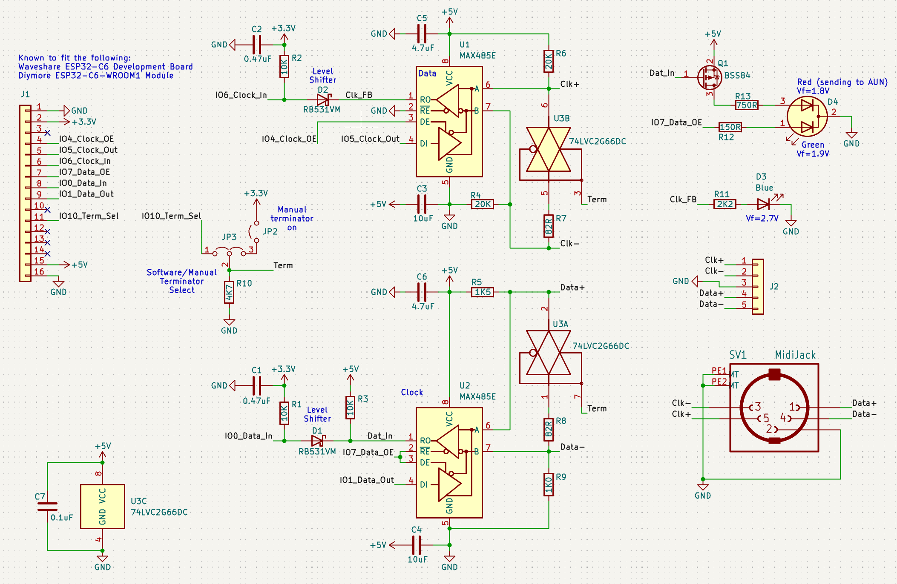
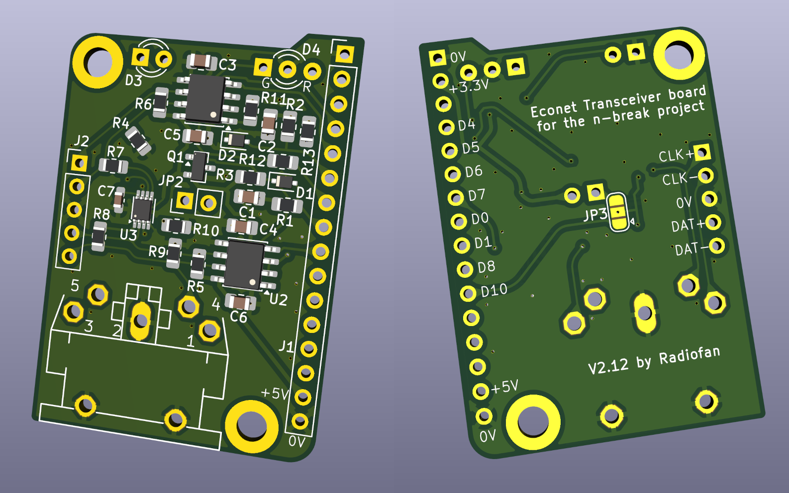
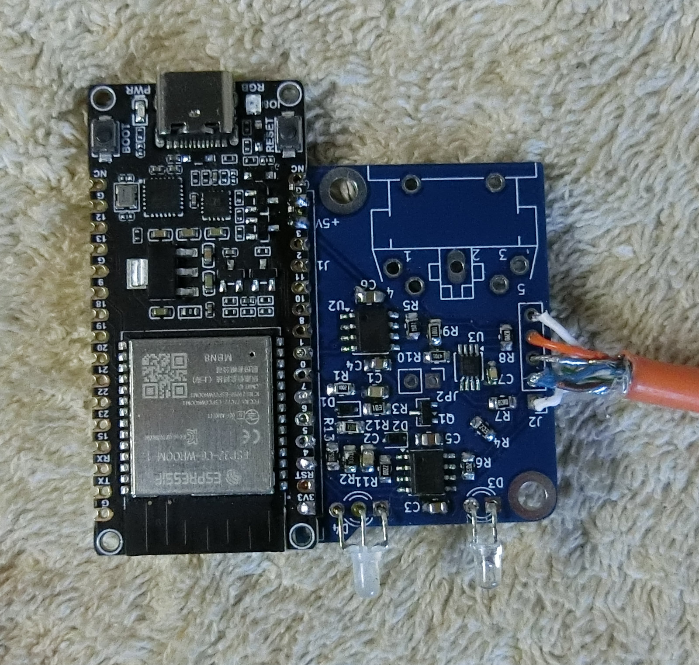

# nbreak_pcb

This is an Econet transceiver PCB designed for [the n-break project](https://github.com/banksy-git/nbreak-econet), using Kicad. Currently, only the [eRadiofan fork](https://github.com/eRadiofan/nbreak-econet) is compatible and tested as working with this PCB.

The board is intended to be soldered to an ESP32-C6 module, the following are know to fit:

- Waveshare ESP32-C6 Development Board
- Diymore ESP32-C6-WROOM1 Module

Many others have a suitable pinout.

The board hosts 2 MAX485 chips running at 5V with level shifters for interfacing with the ESP32-C6.

Connection is via 5-pin DIN and/or 5-pin header.

Internal/external clock selection is via the UI. There is a link for enabling on-board terminators and a jumper option for enabling selection via the UI in the future.

There is a blue LED for indication of a clock signal and a bi-colour LED for indication of transmission and reception. They are designed as 3mm through-hole types intended for poking through holes in a case (TBD).

The PCB is only 31mm wide and 44mm long.

Version 1 assembled (wired direct to header) and soldered to ESP32-C6 board:

Version 2 contains a correction to the footprint of IC U3 and has a connection to D10 instead of D8.
